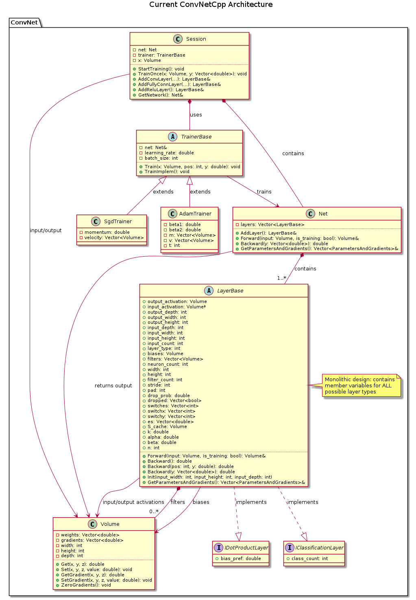
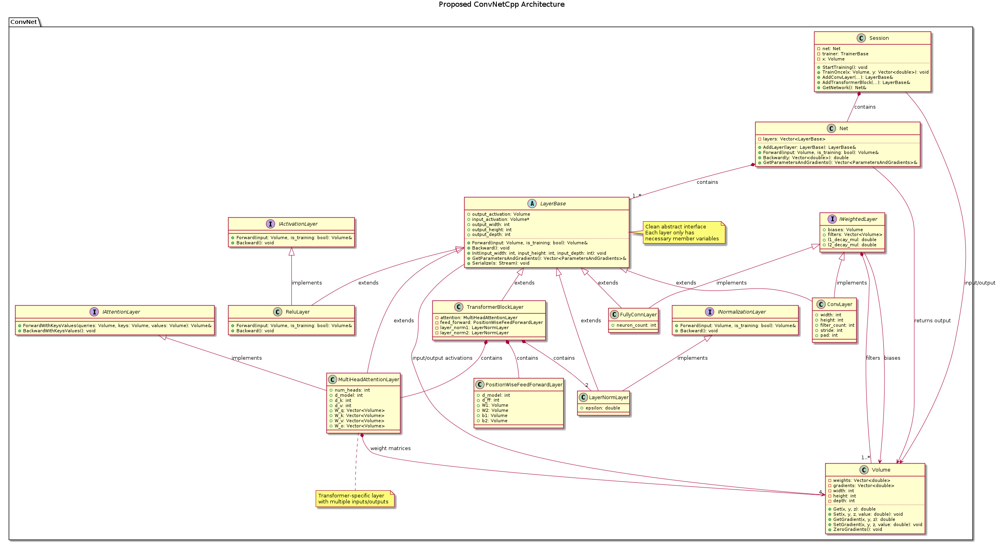
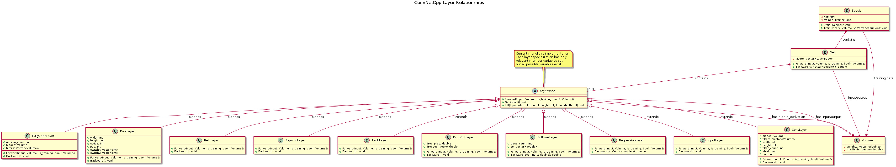

# UML Diagrams for ConvNetCpp Architecture

This document explains the UML diagrams created to visualize the ConvNetCpp architecture, both current and proposed future implementations.

## Class Architecture Diagrams

The following diagrams were created using PlantUML to visualize the class structure and relationships of the ConvNetCpp library:

### 1. Current Architecture

This diagram shows the **current monolithic architecture** of ConvNetCpp:

- **LayerBase** class contains ALL possible member variables for ALL layer types
- Each layer implementation is handled via switch statements within the same class
- This design leads to memory inefficiency as every layer instance has unused member variables
- The architecture is difficult to extend with new layer types like attention mechanisms
- All layers share the same base class regardless of their specific functionality

### 2. Proposed Architecture

This diagram shows the **proposed modular architecture** for better support of Transformers and GPT:

- **Proper inheritance** with abstract LayerBase interface
- **Specialized interfaces** for different layer categories (IWeightedLayer, IActivationLayer, etc.)
- **Clean separation** of concerns where each layer only has necessary member variables
- **Extensibility** for attention mechanisms needed in Transformers
- **Forward compatibility** for hardware acceleration (GPU, CUDA, OpenCL, etc.)

### 3. Layer Relationships

This diagram illustrates the **relationships between different layer types**:

- Shows inheritance hierarchy of the various layer implementations
- Demonstrates how layers connect and interact with Volume objects
- Highlights the data flow patterns through the network
- Shows relationships between network components (Net, Session, etc.)

## Benefits of the Proposed Architecture

The proposed architecture enables:

1. **Transformer Support**: Multi-head attention, layer normalization, and residual connections
2. **GPT Implementation**: Autoregressive models with masked self-attention
3. **Memory Efficiency**: Each layer type only contains necessary variables
4. **Maintainability**: Separation of concerns makes debugging easier
5. **Hardware Acceleration Ready**: Proper interface design supports CPU/GPU implementations
6. **Backward Compatibility**: Maintains compatibility with existing Examples

## Forward Compatibility for Hardware Acceleration

The new architecture is designed with future hardware acceleration in mind:

- Abstract interfaces allow for different implementation backends
- Tensor operations can be implemented with CUDA, OpenCL, or other acceleration libraries
- Memory layout considerations for GPU processing
- Batch processing optimizations for parallel computation

## File Information

- **Tools Used**: PlantUML for diagram creation, ImageMagick for format conversion
- **Source Files**: `.puml` files in the `docs/` directory
- **Generated Files**: `.jpg` files in the `docs/` directory
- **Ignored Files**: `.png` files are in `.gitignore` to avoid committing intermediate files